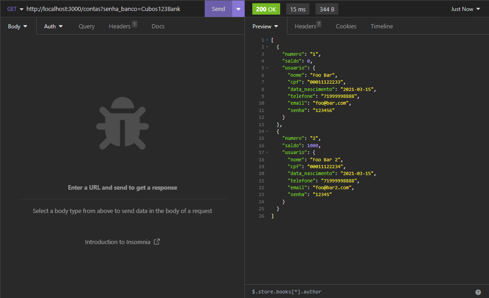
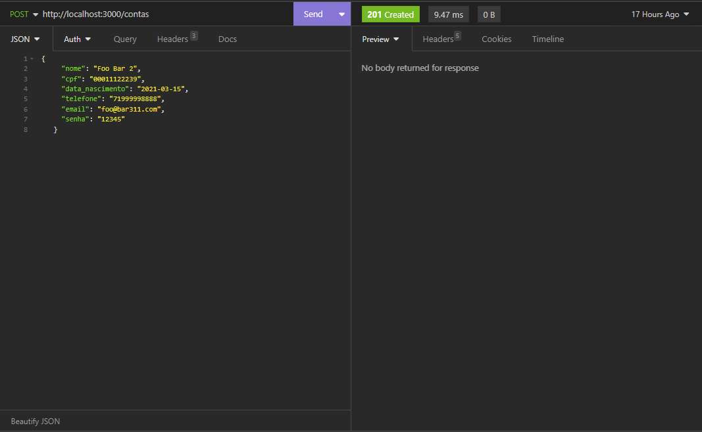
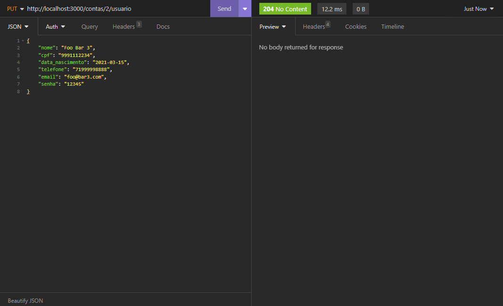
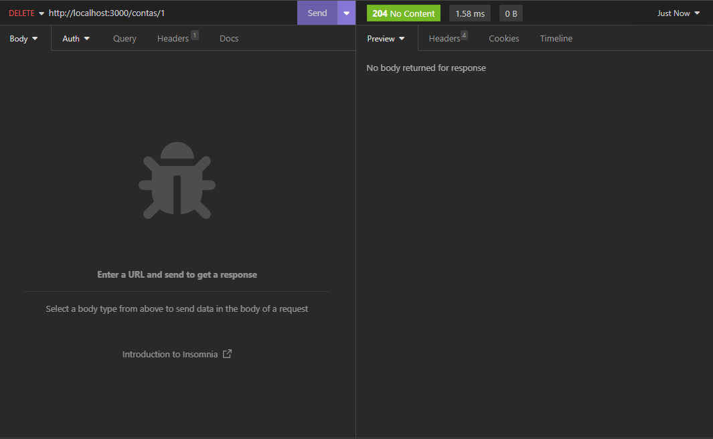
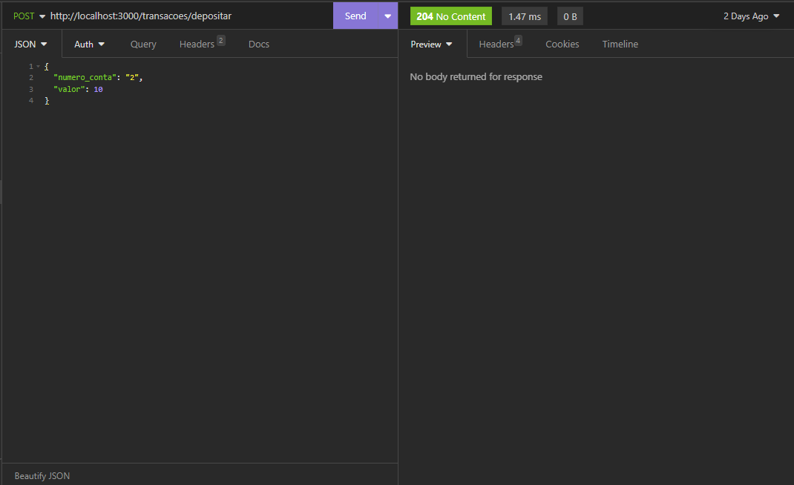
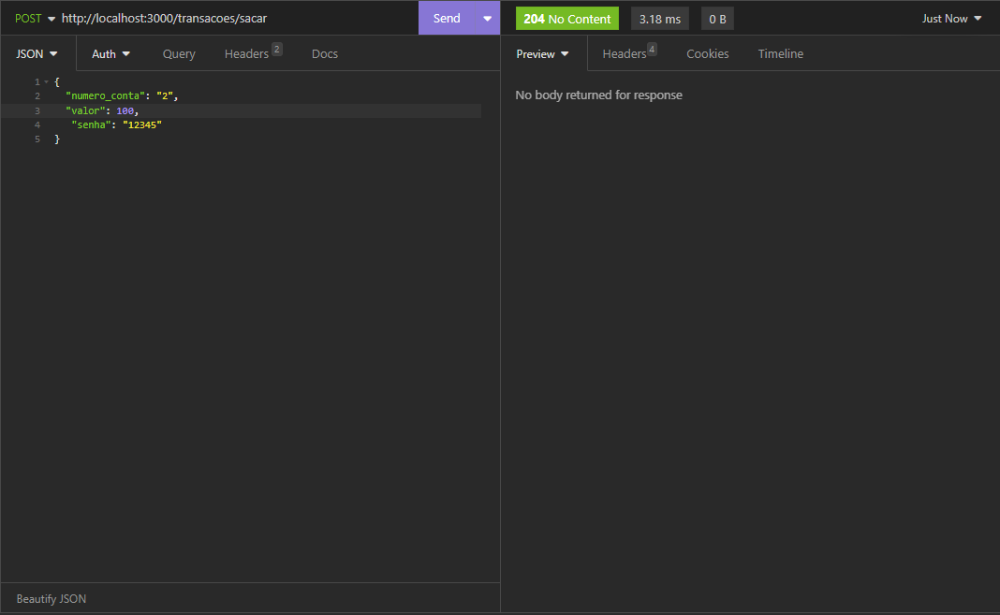
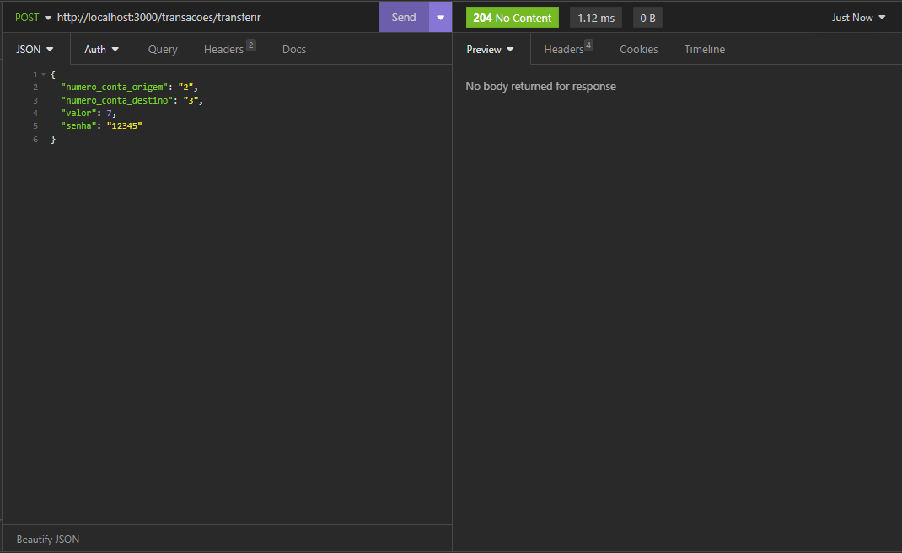
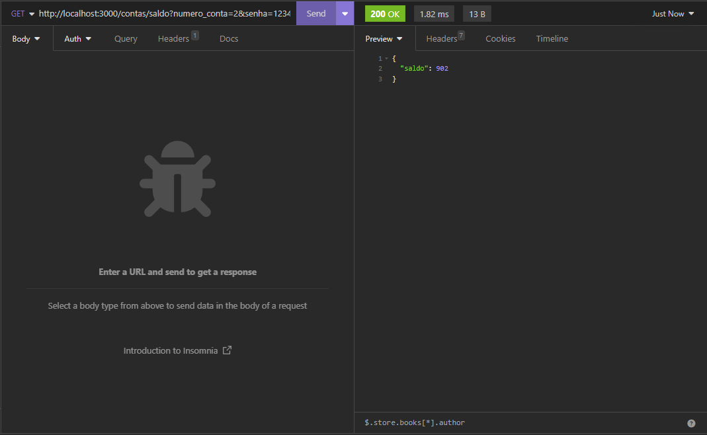
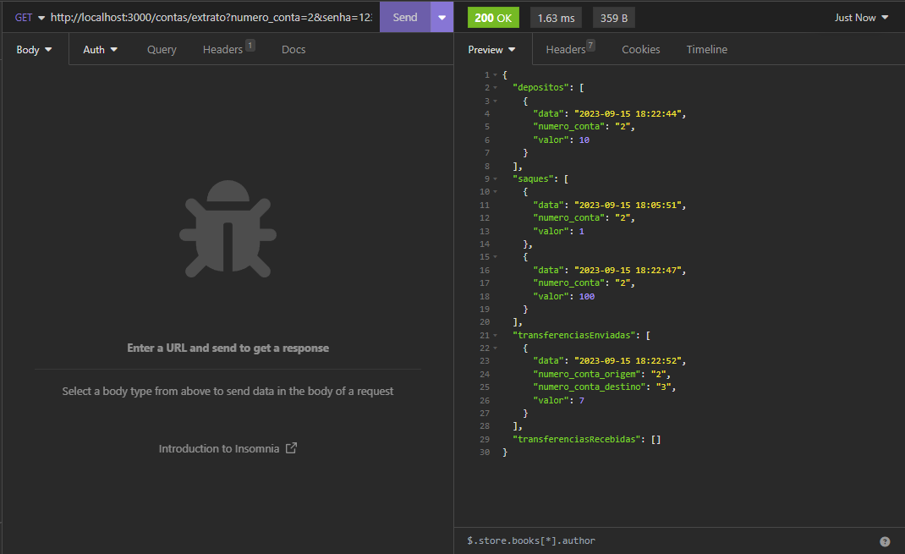

<h1 align="center">:file_cabinet: Sistema Bancario</h1>

## :memo: Descrição
Projeto de sistema bancario no qual é possivel, criar, atualizar e excluir contas, fazer saques, depositos e transferencias de valores, consultar saldo e emitir extrato, funcionalides essas que são acessadas atráves de rotas HTTP.

Desenvolvido na linguagem JavaScript usando NodeJs para instalação de bibliotecas(pacotes) NPM que facilitam e tornam possíveis as interações entre cliente e servidor. 


## :books: Funcionalidades
* <b>Listar contas</b>: Nessa funcionalidade o cliente pode ver todas as contas cadastradas no banco, contas essas que retornaram no corpo da resposta no formato json. 
-Para obter a resposta da rota é nescessario fazer uma requisição http apontando a porta em seguida passando os parametros de rotas e query params, sendo eles que /contas?senha-banco=(senha escolhida pelo desenvolvedor).

        Verbo: GET
        Rota:  http://localhost:3000/contas?senha_banco=Cubos123Bank

        



* <b>Criação De conta Bancaria</b>: Essa funcionalidade possibilita a criação de contas, passando informações através do corpo da requisição em formato Json, apenas os campos de usuario são informados na requisição os demais campos como numero da conta, saldo são gerados altomaticamente pelo sistema. observe que ao criar a conta o saldo é 0(zero).


        Verbo: GET
        Rota:http://localhost:3000/contas
        infomações do usuario que devem ser infomadas no corpo da requisição como JSon:

        nome

        cpf

        data_nascimento

        telefone

        e-mail

        senha




* <b>Atualização de usuário de uma conta</b>: Essa funcionalidade possibilita a Atualização de dados de usuário de uma conta especifica. É nescessarioo que seja infomado como parametro de rota o numero da conta na qual as atualições serão incrementadas. Os dados de usuário devem ser informados no corpo da requisição no formato Json.

        Verbo: PUT
        Rota: http://localhost:3000/contas/2/usuario
        Dados do usuaro que dever ser enviados no corpo da requisição:

        nome

        cpf

        data_nascimento

        telefone

        e-mail

        senha




* <b>Deletar conta bancaria</b>: Essa funcionalidade Exclui uma conta bancaria da memória do banco. Para usalá o cliente deve informar ao servidor o numero da conta como parametro de rota. 

        Verbo: DELETE
        Rota:http://localhost:3000/contas/1



* <b>Depositar </b>: Essa funcionalidade possibilita o deposito dee valores em uma conta expecifica. No corpo da requisição a informações que devem ser enviadas são o numero da conta e o valor a ser depositado. 


        Verbo: POST
        Rota: http://localhost:3000/transacoes/depositar
        Dados do usuaro que dever ser enviados no corpo da requisição:

        numero_conta 
        Valor



* <b>Sacar</b>: Essa funcionalidade possibilita o saque de valores de uma determinada conta que deve ser informada no corpo da requisção junto com o valor a ser sacado e a SENHA.

    
        Verbo: POST
        Rota: http://localhost:3000/transacoes/depositar
        Dados do usuaro que dever ser enviados no corpo da requisição:

        numero_conta
        Valor
        Senha



* <b>Transferir</b>: Essa funcionalidade possibilita transferir valores de uma conta para outra conta. Para usala devem ser informados no corpo da requisição Numero da conta de origem, Numero da conta de Destino, Valor a ser transferido e senha da conta de origem.

        Verbo: POST
        Rota: http://localhost:3000/transacoes/transferir
        Dados do usuaro que dever ser enviados no corpo da requisição:

        numero_conta_origem
        numero_conta_destino
        valor
        senha




* <b>Consultar Saldo 6</b>: Essa funcionalidade Torna possivel a consulta do saldo de uma conta. Conta essa que deve ser informada na rota junto com a senha 

        Verbo: GET
        Rota: http://localhost:3000/contas/saldo?numero_conta=2&senha=12345
       
 **Requisição** - query params

    -   numero_conta
    -   senha



* <b>Emitir extrato</b>: Essa Funcionalidade permite Emitir todo o historico de depositos, saldos e transferencias de uma determinada Conta, é nescessário passar no corpo da requisição as informações, Numero da conta, e senha.

        Verbo: GEt
        Rota: http://localhost:3000/contas/extrato?numero_conta=2&senha=12345
        Dados do usuaro que dever ser enviados como parametros de rota:

        numero_conta
        senha



## :wrench: Tecnologias utilizadas
* Tecnologia;

## :rocket: Rodando o projeto
Para rodar o repositório é necessário clonar o mesmo, dar o seguinte comando para iniciar o projeto:
```
git clone 
```

